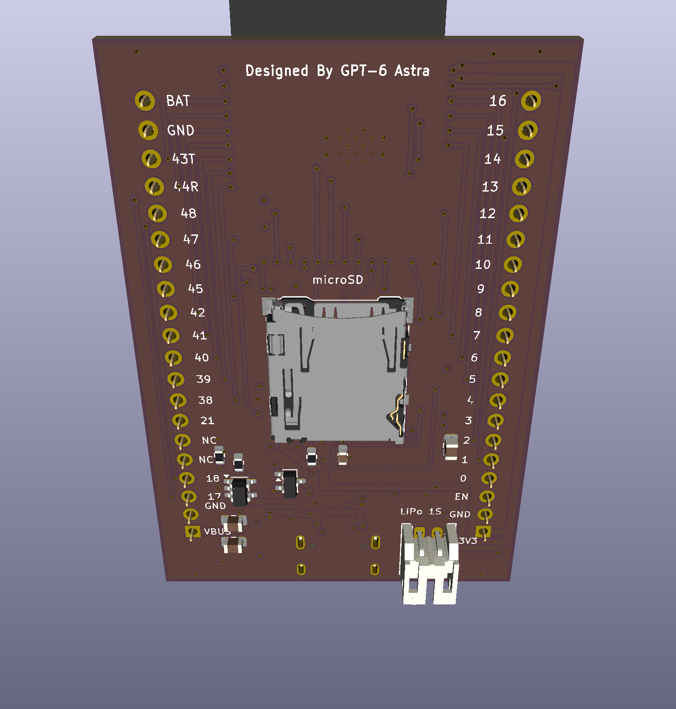

# Matrix Six

ESP32-S3-WROOM-1-N8R8を使った、Matrix5シールド向けのKiCad 10開発基板です。現行設計は **v0.6**。オートルーターを使わず、部品配置と配線を個別に指定しました。



## KiCadで開く

[Matrix6.kicad_pro](hardware/Matrix6/Matrix6.kicad_pro)をKiCad 10で開いてください。KiCad標準のシンボル・フットプリント・3Dモデルライブラリをインストールし、同じフォルダーの `DevBoard.pretty` と `fp-lib-table` を一緒に保管します。動作確認版はKiCad 10.0.6です。

- ESP32-S3-WROOM-1-N8R8、ネイティブUSB-C、TPS63001によるUSB／LiPo両対応3.3 V電源。
- 裏面microSD（CS=10、MOSI=11、CLK=12、MISO=13）。口はアンテナ側へ向け、15.8 × 22.5 mmの抜き差し空間を確保。
- 裏面JST-PH 2ピンLiPo端子、MCP73831で公称100 mA充電、AO3401AによるUSB／電池自動切替。
- USBの左にRESET、右にBOOT。基板下部の赤LEDは `POWER`、青LEDはGPIO48の `PIN 48`。
- 40.64 × 61.00 mm、4層。L2は連続GND、USBは表面のみ・ビア0。
- H1/H2は各20ピン、ピッチ2.54 mm、列間33.02 mmのメスソケット。1番ピンはUSB側。
- 表面に `Matrix Six`、裏面に `Designed By GPT-6 Astra`。

## Matrix5シールドとの互換性

[Matrix5](https://github.com/FaBoAI/Matrix5)のMainとS1〜S11の実設計から端子情報を読み取り、全40位置と各シールドの使用信号を照合しました。**38端子の割り当てを合わせ、H2.20はVBAT**です。H2.5 / H2.6はNC（Matrix5のUSB D− / D＋）で、確認した11シールドはいずれも使用していません。

[端子表・シールド別照合・取り付け条件](docs/matrix5-compatibility.md)を参照してください。XY位置と使用ピンは一致していますが、積層高さ、アンテナ周辺、通電動作は実機での確認が必要です。USB-UART機能は追加していません。SDはシールドのSPI/I2C用GPIO11〜13を共有するため、競合する使い方ではカードを抜いてください。

電源計算の条件は周囲50℃、**3.3 V合計500 mA（MCU・SDを含む）＋VBUSシールド負荷100 mA＋充電100 mA**です。H1.1/H2.1は出力専用で、H2.1へ外部給電するとUSBへ逆給電できます。大電流のLED全点灯・コイル・ヒーターはこの条件に含みません。GPIOは3.3 Vで、S1用5 Vレベル変換はありません。

LiPoは保護回路付き1セル3.7 V／満充電4.2 V、500 mAh以上・放電定格1 A以上を基準とします。J3は**1番BAT+、2番GND**。同じJST形状でも電池側の極性を確認してください。電池動作中のH2.1に5 Vは出ません。セル温度センサーは搭載していません。

## 検証と図面

| 項目 | 保存したv0.6の結果 |
|---|---|
| DRC / ERC / 未配線 / 回路図整合性 | すべて0件 |
| SD抜き差し空間 | 裏面15.8 × 22.5 mm、部品の配置禁止領域。重なり0 |
| Matrix5端子照合 | 全11シールドの使用ピン・40位置が一致 |
| USB | v0.4の銅配線を保持、表面のみ・ビア0 |
| USB本体下 | 表面配線・ビア・ベタ0。禁止領域の負の試験でも検出を確認 |
| L2 GND | 連続1領域、USB直下13,182点の欠損0 |
| 電源降下の計算 | 3.3 V・500 mAでモジュールまで53.5 mV、H1まで31.4 mV |

- [回路図](docs/validation/schematic.png) / [表面配線](docs/validation/pcb-top.png) / [裏面配線](docs/validation/pcb-bottom.png) / [SD抜き差し図](docs/validation/sd-access.svg)
- [DRC](docs/validation/drc.json) / [ERC](docs/validation/erc.json) / [シールド照合](docs/validation/matrix5-compatibility.json)
- [USB禁止領域](docs/validation/usb-keepout-validation.json) / [配線・電源計算](docs/validation/electrical-audit.json) / [GND計算](docs/validation/ground-plane-dc.json)
- [検証対象CADのSHA-256](docs/validation/cad-sha256.json)

JLC04161H-7628相当の層構成を設定し、USB均一断面の既存2D推定は約91.1 Ωです。USBのA側長さにはR11のパッド間1.65 mmを含みます。これらは設計計算であり、製造者のインピーダンス承認・TDR・USB動作・負荷と温度の実測結果ではありません。現段階は試作設計です。v0.5の見積もりには旧BOM/CPLをアップロード済みですが、v0.6とは一致しません。

## JLCPCBへの試作発注

[v0.6の見積もり用データ](manufacturing/v0.6/README.md)を用意しています。両面実装へ変更したため、旧v0.5の見積もりをそのまま注文しないでください。最新の部品在庫・極性と回転、コンデンサの実効容量、製造スタックアップの確認を残しており、製造リリース・注文・決済は未実施です。

## 検証の再実行

```sh
python3 scripts/verify_project.py
```

リポジトリをgit cloneして実行してください。USB配線・設計ルールの保持確認には初期コミットの履歴が必要です。KiCad CLIと `pcbnew` / `wx` を使えるPythonが必要です。macOSの標準KiCadインストールは自動選択します。他の環境では `KICAD_CLI` と `KICAD_PYTHON` を指定してください。`ANALYSIS_PYTHON` にNumPy / SciPy / Shapely / Matplotlibを導入したPythonを指定すると、L2のDC計算も再実行します。検証はゾーンを再充填してPCBを保存し、レポートを更新するため、GUI上の編集を先に保存してください。

`scripts/manual_matrix5_layout.py` は初期インポートのコミットを入力とした、座標指定による移行記録です。オートルーターではありません。再実行すると後からのCAD編集を上書きするので、通常の検証には使いません。

v0.6の回路選定・電源条件は [設計メモ](docs/matrix-six-v06.md) に記録しています。

旧DevBoardの資料は [docs/devboard-v04](docs/devboard-v04/README.md) に履歴として保存しています。現在の端子・給電条件はこのREADMEとv0.6の互換性資料を使用してください。ライブラリの帰属は [THIRD_PARTY_NOTICES.md](THIRD_PARTY_NOTICES.md) に記載しています。
