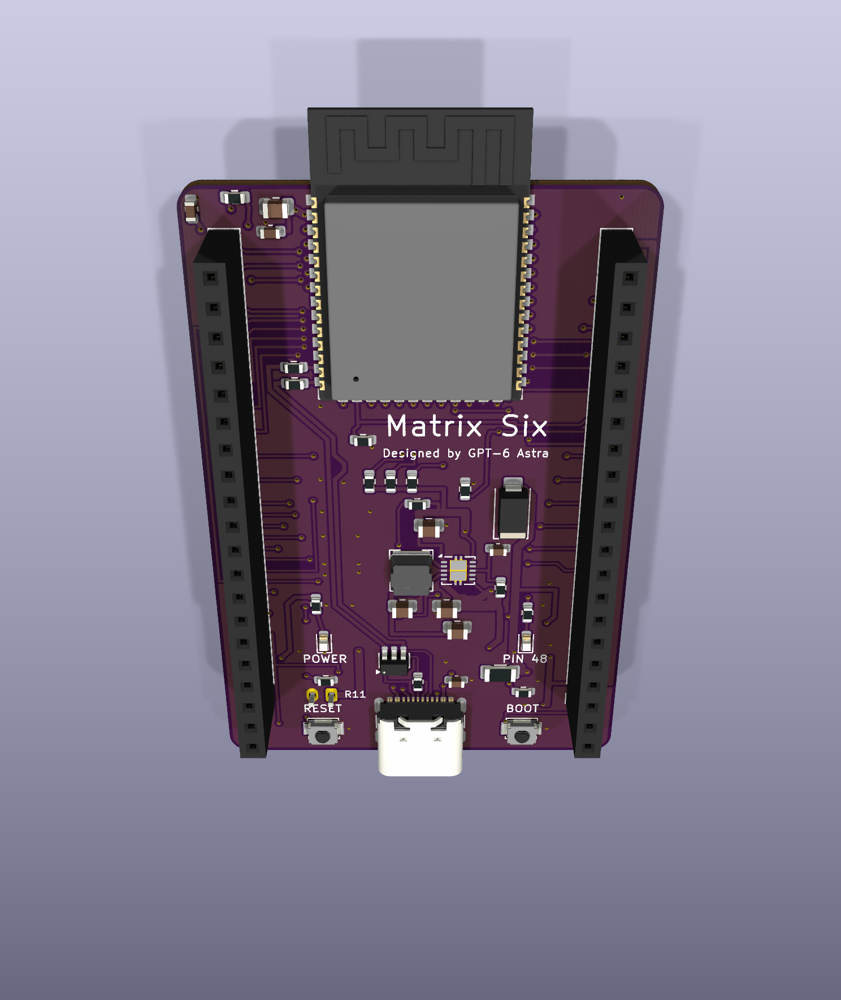

# Matrix Six

ESP32-S3-WROOM-1-N8R8を使った、Matrix5シールド向けのKiCad 10開発基板です。現行設計は **v0.8（2層・四隅R2 mm）**。内層配線を表裏へ移し、USBとGNDを再設計しました。オートルーターは使わず、部品配置と配線を個別に指定しています。




## KiCadで開く

[Matrix6.kicad_pro](hardware/Matrix6/Matrix6.kicad_pro)をKiCad 10で開いてください。KiCad標準のシンボル・フットプリント・3Dモデルライブラリをインストールし、同じフォルダーの `DevBoard.pretty` と `fp-lib-table` を一緒に保管します。動作確認版はKiCad 10.0.6です。

- ESP32-S3-WROOM-1-N8R8、ネイティブUSB-C、TPS63001によるUSB／LiPo両対応3.3 V電源。
- 裏面microSD（CS=10、MOSI=11、CLK=12、MISO=13）。口はアンテナ側へ向け、15.8 × 22.5 mmの抜き差し空間を確保。
- 裏面JST-PH 2ピンLiPo端子、MCP73831で公称100 mA充電、AO3401AによるUSB／電池自動切替。
- USBの左にRESET、右にBOOT。基板下部の赤LEDは `POWER`、青LEDはGPIO48の `PIN 48`。
- 40.64 × 61.00 mm、四隅R2 mm、2層FR4・公称1.6 mm・両面1 oz。USBは表面のみ・ビア0。表面のUSB両脇にGNDを確保し、表裏のGNDベタをビアで接続。
- H1/H2は各20ピン、ピッチ2.54 mm、列間33.02 mmのメスソケット。1番ピンはUSB側。
- 表面中央に大きな `Matrix Six`（文字高2.0 mm）、その直下に `Designed by GPT-6 Astra`（0.8 mm）。

## Matrix5シールドとの互換性

[Matrix5](https://github.com/FaBoAI/Matrix5)のMainとS1〜S11の実設計から端子情報を読み取り、全40位置と各シールドの使用信号を照合しました。**38端子の割り当てを合わせ、H2.20はVBAT**です。H2.5 / H2.6はNC（Matrix5のUSB D− / D＋）で、確認した11シールドはいずれも使用していません。

[端子表・シールド別照合・取り付け条件](docs/matrix5-compatibility.md)を参照してください。XY位置と使用ピンは一致していますが、積層高さ、アンテナ周辺、通電動作は実機での確認が必要です。USB-UART機能は追加していません。SDはシールドのSPI/I2C用GPIO11〜13を共有するため、競合する使い方ではカードを抜いてください。

電源計算の条件は周囲50℃、**3.3 V合計500 mA（MCU・SDを含む）＋VBUSシールド負荷100 mA＋充電100 mA**です。H1.1/H2.1は出力専用で、H2.1へ外部給電するとUSBへ逆給電できます。大電流のLED全点灯・コイル・ヒーターはこの条件に含みません。GPIOは3.3 Vで、S1用5 Vレベル変換はありません。

LiPoは保護回路付き1セル3.7 V／満充電4.2 V、500 mAh以上・放電定格1 A以上を基準とします。J3は**1番BAT+、2番GND**。同じJST形状でも電池側の極性を確認してください。電池動作中のH2.1に5 Vは出ません。セル温度センサーは搭載していません。

## 検証と図面

| 項目 | 保存したv0.8の結果 |
|---|---|
| DRC / ERC / 未配線 / 回路図整合性 | すべて0件 |
| 外形 | 四隅R2 mm、直線4本＋円弧4本で閉じた輪郭 |
| SD抜き差し空間 | 裏面15.8 × 22.5 mm、部品の配置禁止領域。重なり0 |
| Matrix5端子照合 | 全11シールドの使用ピン・40位置が一致 |
| USB | 表面のみ・ビア0、A/B両側とも幾何学的な長さ差0.01 mm未満 |
| USB本体下 | 表面配線・ビア・ベタ0。禁止領域の負の試験でも検出を確認 |
| USB直線部の表面GND | 両脇の幅0.5 mmを各1,563点検査、欠損0 |
| 電源降下の計算 | 3.3 V・500 mAでモジュールまで49.9 mV、H1まで27.9 mV |
| GND帰路のDC計算 | モジュール帰路500 mAで2.35 mV、入力帰路800 mAで6.45 mV |
| 最小ドリル | 0.3 mm。U1放熱穴はパッド0.8 mm、環状幅0.25 mm |

- [回路図](docs/validation/schematic.png) / [表面配線](docs/validation/pcb-top.png) / [裏面配線](docs/validation/pcb-bottom.png) / [SD抜き差し図](docs/validation/sd-access.svg)
- [DRC](docs/validation/drc.json) / [ERC](docs/validation/erc.json) / [シールド照合](docs/validation/matrix5-compatibility.json)
- [USB禁止領域](docs/validation/usb-keepout-validation.json) / [配線・電源計算](docs/validation/electrical-audit.json) / [GND計算](docs/validation/ground-plane-dc.json)
- [2層化の設計・検証範囲](docs/matrix-six-v08.md) / [USB断面計算](docs/analysis/two-layer-usb.json) / [表面GND検査](docs/validation/two-layer-ground.json)
- [検証対象CADのSHA-256](docs/validation/cad-sha256.json) / [回路図と30°3Dの並列表示](docs/validation/schematic-and-3d.png)

USBの均一断面は幅0.38 mm・線間0.18 mm・表面GNDとの間隔0.20 mm。FR4のεr=4.5を仮定した2D計算は約90.3 Ωです。裏面GNDは信号配線で4領域に分かれ、表面とビアで接続されており、連続した裏面参照プレーンではありません。USBの主な帰路は表面の両脇GNDとして設計しています。A側の長さにはR11のパッド間1.65 mmを含みます。

JLCPCB標準2層での管理インピーダンス保証は前提にしていません。断面・DC・配線温度の結果は設計計算であり、局所的な曲がりや長さ調整、コネクタを含むUSBの実測保証ではありません。試作機でUSB両挿し向き、SI/EMC、SD同時動作、給電切替・負荷・温度を確認します。

## JLCPCBへの試作発注

[v0.8の2層版製造データ](manufacturing/v0.8/README.md)を使用してください。48部品・26 BOMグループの型番は継承していますが、部品移動と表裏変更があるため **CPLもv0.8へ差し替えが必要**です。U1/U2等の放熱・パッド内ビアには充填と銅キャップを要求しており、両面実装費も残ります。最終削減額は新しい見積もりで確認してください。

既存のv0.7注文は4層版のデータです。v0.8の製造データとの混用はできません。部品在庫、実装位置・極性、CAMの確認が必要で、この作業では支払い・製造承認は行っていません。

JLCPCBに最終Gerberをアップロードし、基板5枚のWeb表示額は **$83.27**（部品・実装・送料別）でした。旧4層注文の$120.47から約31%減ですが、条件を最適化した4層比較額$86.68との差は約4%です。[見積もり内訳と条件](docs/analysis/two-layer-v08-quote.md)

## 検証の再実行

```sh
python3 scripts/verify_project.py
```

リポジトリをgit cloneして実行してください。設計ルール・互換性・外形の比較にはgit履歴が必要です。KiCad CLIと `pcbnew` / `wx` を使えるPythonが必要です。macOSの標準KiCadインストールは自動選択します。他の環境では `KICAD_CLI` と `KICAD_PYTHON` を指定してください。`ANALYSIS_PYTHON` にNumPy / SciPy / Shapely / Matplotlibを導入したPythonを指定すると、表裏を接続したGNDのDC計算も再実行します。検証はゾーンを再充填してPCBを保存し、レポートを更新するため、GUI上の編集を先に保存してください。

`scripts/manual_matrix5_layout.py` は初期インポートのコミットを入力とした、座標指定による移行記録です。オートルーターではありません。再実行すると後からのCAD編集を上書きするので、通常の検証には使いません。

v0.6の回路選定・電源条件は [設計メモ](docs/matrix-six-v06.md) に記録しています。

v0.7の外形変更は `scripts/round_board_corners.py`、v0.8の2層化は `scripts/redesign_two_layer.py` と `scripts/two_layer_routes.py` に記録しています。後者は `f12c10f` の4層CADから座標指定の変更を再生し、現在のCADを上書きするため通常の検証には使いません。v0.8の [外形検証](docs/validation/rounded-corners.json) はR2輪郭の保持と0.3 mm最小穴を確認します。版別の製造出力はPCBのリビジョンから出力先を決定します。

旧DevBoardの資料は [docs/devboard-v04](docs/devboard-v04/README.md) に履歴として保存しています。現在の端子・給電条件はこのREADMEとv0.6の互換性資料を使用してください。ライブラリの帰属は [THIRD_PARTY_NOTICES.md](THIRD_PARTY_NOTICES.md) に記載しています。
