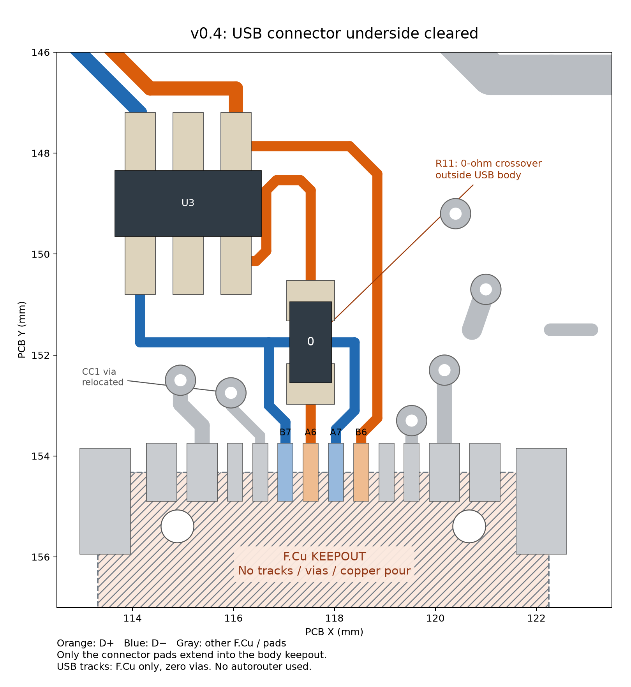

# v0.4 電気設計レビュー

対象：`ESP32-S3-DevBoard.kicad_pcb / .kicad_sch / .kicad_pro / .kicad_dru`。2026-09-07、KiCad 10.0.6。

追記：表面中央に `Designed By GPT-6 Astra` を追加しました。文字以外の基板データが前版と完全一致することを構文比較で確認し、DRC・未配線・回路図整合性を再確認しました（いずれも0件）。`review/design-credit-validation.json` に変更前後のハッシュと比較結果を記録しています。以下のUSB禁止領域試験は文字追加前の基板で実施した記録で、配線・部品・禁止領域は変わっていません。

## 1. 修正内容と判定範囲

USBコネクタ本体下の配線退避、禁止領域の登録、USBの長さ合わせ、4層スタックアップ、専用GND層、電源配線の拡幅、熱損失の大きいLDOから降圧回路への変更を実施しました。設定した設計条件について、保存されたPCBの配線形状・接続・層構成を再検証しています。オートルーターは使用していません。

DRC合格と、実測によるUSB／熱設計の認定は別の確認です。本レビューは試作前の設計計算です。量産承認・製造業者によるインピーダンス保証・実測温度を表すものではありません。

設計条件：3.3 V側の合計負荷500 mA連続、周囲50℃、USBコネクタにおける負荷時電圧4.75～5.25 V。3V3ヘッダは出力専用、5Vヘッダ入力は安定化5 Vのみです。USB入力側は550 mAで配線を評価しました。各ヘッダの500 mA計算は個別の評価ケースであり、同時に各500 mAを供給する定格ではありません。

## 2. USBの長さとインピーダンス

[EspressifのUSBレイアウト指針](https://docs.espressif.com/projects/esp-hardware-design-guidelines/en/latest/esp32s3/pcb-layout-design.html#usb)の90 Ω ±10%、等長、連続した基準GND、ビア削減を設計目標にしました。

| 経路：直列抵抗のUSB側パッドからUSB-C | D−中心線長 | D＋中心線長 | 長さ差 |
| --- | ---: | ---: | ---: |
| A7 / A6（R11の端子間寸法を含む） | 48.0197 mm | 48.0197 mm | <0.001 mm |
| B7 / B6 | 46.3031 mm | 46.3031 mm | <0.001 mm |
| モジュールから直列抵抗 | 1.7145 mm | 1.7116 mm | 0.0029 mm |

全USB配線はF.Cu、USBビアは0個です。許容差は0.10 mmで管理します。小数点以下の値はCAD上の中心線長で、製造精度や端子内部の電気長を表しません。USB-CのA/B重複接点への分岐も、それぞれ独立に確認しました。

v0.4ではA6側に実装必須の0ΩジャンパーR11を追加しました。B接点は通常DRCの `fromTo` で0.10 mmを検査し、A/Bの両経路を独立スクリプトで測定します。A6経路はネットがR11で分かれるため、連続ネット用DRCをそのまま流用しません。A側D＋の銅箔・パッド中心までの幾何長は46.3697 mm、R11のパッド中心間距離は1.6500 mm、合計48.0197 mmです。これはジャンパー内部の実測電気長ではありません。パッケージの遅延・寄生容量・不連続は実機評価に含めます。旧v0.3のA接点用DRCレポートはv0.4の根拠には使いません。

### USBコネクタ本体下の配線：退避と禁止領域の登録を完了

採用部品はGCT USB4105-GF-A-120です。[メーカー図面](https://gct.co/files/drawings/usb4105.pdf)のRev. B4（2023-12-18）1ページ目にある本体外形全体を使い、プロジェクト独自の保守的な禁止領域を登録しました。メーカーがこの範囲の配線を一律禁止していると主張するものではありません。

- J1のフットプリントを `DevBoard:USB4105_NoUnderbodyCopper` とし、F.Cuの配線・ビア・ベタを禁止。メーカー図面に対応するコネクタ自身のパッド・穴・外形寸法は維持しています。
- 禁止領域は基板座標x=113.310～122.250 mm、y=154.325～161.675 mmです。内層のGNDは維持しています。
- D＋の本体側0.605 mm折り返しを撤去。信号・電源・CCの表面配線はパッド内のy=154.000 mmで止め、コネクタ本体へ入りません。D＋配線の銅箔端から本体外形まで0.225 mmです。
- CC1ビアを(116.53,156.30)から(115.95,152.75)へ移動。表面配線と内層配線を引き直し、本体下を通るCC1経路を撤去しました。
- R11を(117.53,151.75)に追加し、コネクタ本体外でD＋のA6枝を交差させました。部品は[Vishay CRCW06030000Z0EA](https://www.vishay.com/docs/20035/dcrcwe3.pdf)、0603の0Ωジャンパーです。回路図・PCBのMPNを一致させています。R11を未実装にすると片向きのUSB通信が成立しません。
- U3を(115.10,149.00)へ移動し、周辺のVBUS/GND配線を整理しました。USBは全区間F.Cuで、USBビアは0個です。オートルーターは使っていません。

保存基板の本体下トラック・ビアは0件、表面ベタの内部サンプル6,497点中、銅箔ありは0点です。コネクタ自身の接続パッドは必要なので禁止対象から除き、内層GNDの連続性も別に検査しています。

さらに、**一時コピーだけ**に本体下の配線1本とビア1個を置く負の試験を行い、両方で `items_not_allowed` 違反が発生することを確認しました。試験用の違反は製品基板に保存していません。`review/usb-keepout-validation.json` が合否の記録、`review/usb-keepout-probe.json` は故意に違反を入れた一時コピーのDRC出力です。製品基板の `drc-final.json` は違反0です。

この退避により、問題となった本体下トラック／ビアをレジストの絶縁性能に依存させる状態は解消しました。通常のはんだ実装確認とUSB動作試験は別途実施します。



### 採用スタックアップ

[JLCPCBのスタックアップ／計算画面](https://jlcpcb.com/pcb-impedance-calculator)で確認した **JLC04161H-7628、4層、呼称1.6 mm、外層1 oz・内層0.5 oz** を設定しました。

| 層 | 厚さ | 用途・材料 |
| --- | ---: | --- |
| F.Cu | 0.0350 mm | 部品・USB・局所電源・GND |
| プリプレグ | 0.2104 mm | 7628 RC49%、計算εr=4.4 |
| In1.Cu / L2 | 0.0152 mm | 専用GND |
| コア | 1.0650 mm | FR4、設定εr=4.6 |
| In2.Cu / L3 | 0.0152 mm | 電源・GPIO |
| プリプレグ | 0.2104 mm | 7628 RC49%、計算εr=4.4 |
| B.Cu | 0.0350 mm | 電源主配線・GPIO・GND |

銅箔＋絶縁材の合計は1.5862 mm。KiCadには表裏各0.0127 mmのソルダーレジストを含む1.6116 mmを登録しました。製造指示上は上記の呼称1.6 mmスタックアップです。表面処理はENIG設定です。

均一区間の寸法は配線幅0.28 mm、ペア間のエッジ間隔0.20 mm、表面GNDとの間隔0.50 mm、基準面まで0.2104 mm、銅厚0.035 mmです。細ピッチの端子逃げは0.20 mmです。εr=4.4は[JLCPCBの材料特性](https://jlcpcb.com/capabilities/pcb-capabilitiesPLC)を参照し、レジストのεr=3.8、導体上厚0.0127 mm・基材上厚0.02032 mmは[同社の計算モデル](https://cart.jlcpcb.com/client/template/placeOrder/impedance.html)を用いました。

独立した2D準静電界計算で奇モード容量Cと真空時C₀を解き、`Zdiff = 2 / (c × √(C × C₀))` から算出しました。

| 計算 | 差動インピーダンス |
| --- | ---: |
| εr=4.4、最大格子5 µm | 90.889 Ω |
| εr=4.4、最大格子2.5 µm | **91.096 Ω** |
| εr=4.6、最大格子5 µm（材料感度） | 89.375 Ω |

格子細分化による差は0.207 Ω。90 Ωの目標範囲81～99 Ω内です。JLCPCBの画面は計算待ちのまま結果を返さなかったため、この数値は**JLCPCBが発行した計算値ではありません**。独立ソルバー・入力・結果を保存しています。

この計算が対象とするのは均一な断面です。コネクタ、ESD素子、抵抗パッド、曲がり、分岐の3D不連続、製造ばらつき、実機のアイパターンは含めていません。基板製造時にこのスタックアップを指定し、実際の誘電率・仕上がり銅厚に基づく製造業者の最終補正と90 Ω差動TDRクーポンを確認してください。


## 3. GNDの連続性

In1.Cuから信号・電源トラックを移し、アンテナ領域を除いた専用GNDゾーン `L2_CONTINUOUS_GND` を設けました。全層のアンテナ禁止領域を保持しています。L2の信号トラックは0本、塗りつぶし銅箔は1つの連続領域です。銅箔面積は約1,933 mm²です。

USB全区間について、0.025 mm間隔で中心と両エッジ外側0.05 mmを検査しました。**13,182点中、L2 GND欠損0点**です。通常のビア・スルーホールのアンチパッドは存在しますが、USB直下を横切るプレーン分断はありません。

降圧回路の入力GNDを最短で閉じ、周辺にGNDビアを追加しました。モジュール下面の露出はんだパッド外側にも4つのGNDビアを配置し、はんだパッド内へのドリル追加を避けています。

実際のL2ポリゴンとアンチパッドを抵抗メッシュにして、モジュール側GNDビア(118.8,109.7)から降圧回路側GNDビア(119.3,141.3)へ500 mAを流した計算では、プレーン降下は約1.36 mVでした。0.25 mm格子では1.43 mV、0.125 mm格子では1.36 mVです。接点は直径0.6 mmの等電位領域とし、点電極の格子依存性を避けました。

表裏GNDの並列効果は計算に含めず、L2だけを評価しています。ビアバレル・表面GND内の局所拡散・はんだの抵抗はこの値に含みません。入力側の電圧予算にはGND戻りとして別途10 mVを確保しました。


## 4. 電源回路と電流容量

元のAP7361C LDOは入力5.25 V、出力約3.3 V、500 mAで約0.99 Wを消費し、周囲50℃・熱抵抗110℃/Wの計算で接合温度約159℃となるため、AP63203WU-7の3.3 V降圧回路へ変更しました。

U2のVINとC1、GNDのループを表面で短く接続し、SWからL1までの銅箔面積を小さくしました。FBは出力コンデンサから分岐し、SWから離して引いています。主配線は3.3 V外層0.8 mm、5 V内層1.0 mm、ヘッダ枝0.8 mmを基本とし、出力主経路のヘッダ間通過部のみ短い0.4 mmです。電源の主要な層間接続にはビアを2本ずつ設けています。

| 部品 | v0.4 |
| --- | --- |
| U2 | AP63203WU-7、TSOT-23-6、固定3.3 V |
| L1 | Bourns SRN4018-4R7M、4.7 µH |
| C1 | 22 µF / 16 V X5R、0805 |
| C2 + C8 | 22 µF / 10 V X5R ×2、0805 |
| C7 | 100 nF / 16 V X7R、0603、BST–SW間 |
| F1 | MF-NSMF110/16X-2、1.1 A hold、1206 |
| D1 | Vishay SS14-E3/61T、SMA |
| R11 | Vishay CRCW06030000Z0EA、0603、0Ω、USB A6枝の交差用 |

[AP63203データシート](https://www.diodes.com/datasheet/download/AP63200-AP63201-AP63203-AP63205.pdf)の固定出力接続と推奨容量を基にしています。L1は推奨範囲2.2～10 µH内で選びました。[SRN4018の定格](https://www.bourns.com/docs/product-datasheets/srn4018.pdf)はIrms=1.9 A、Isat=2.0 A、DCR最大84 mΩです。

Lの−20%公差、1.1 MHzの−6%拡散、入力5.25 Vを使うと、リップル電流0.315 A p-p、500 mA負荷時のピーク0.658 A、実効値0.508 Aです。インダクタの通常運転電流には余裕があり、巻線損失は銅温度60℃で約25 mW、定格温度上昇40℃を電流二乗で換算した粗い見積りは約2.9℃です。IsatはICのピーク電流制限より低いため、2 A運転や故障時の飽和余裕まで保証する設計にはしていません。

C1は使用電圧・温度・公差・経時変化を含む実効容量10 µF以上、C2+C8は合計22 µF以上を部品選定条件としています。名目容量だけでは判定できないため、具体的な採用品番のDCバイアス特性は部品確定時に照合します。入力コンデンサの必要リップル電流は0.25 A rms、出力容量22 µF・合成ESR10 mΩを仮定した定常リップル計算は約4.9 mV p-pです。実測の負荷過渡・制御安定性は別途確認が必要です。

### 銅箔の抵抗と温度上昇

銅の抵抗率は20℃で1.724×10⁻⁵ Ωmm、温度係数0.00393/℃、抵抗計算温度60℃。外層35 µm、内層15.2 µm、ビアのめっき厚20 µmを仮定しました。既存の1本の導通経路を測定し、並列ビア／配線による改善を加算していません。

| 経路 | 評価電流 | 配線抵抗@60℃ | 配線降下 | 最大トラック温度上昇の目安 |
| --- | ---: | ---: | ---: | ---: |
| USB → F1 | 550 mA | 17.08 mΩ | 9.39 mV | 2.58℃ |
| F1 → D1 | 550 mA | 17.60 mΩ | 9.68 mV | 0.51℃ |
| D1 → U2 VIN | 550 mA | 27.78 mΩ | 15.28 mV | 6.77℃ |
| L1出力 → モジュール | 500 mA | 67.78 mΩ | 33.89 mV | 1.29℃ |
| L1出力 → 左3V3ヘッダ | 500 mA | 59.48 mΩ | 29.74 mV | 1.29℃ |
| L1出力 → 右3V3ヘッダ | 500 mA | 25.42 mΩ | 12.71 mV | 0.51℃ |
| D1 → 左5Vヘッダ | 500 mA | 56.01 mΩ | 28.00 mV | 7.87℃ |
| D1 → 右5Vヘッダ | 500 mA | 27.46 mΩ | 13.73 mV | 7.87℃ |

温度上昇は `I=k ΔT^0.44 A^0.725`、外層k=0.048、内層k=0.024のIPC-2221経験式によるスクリーニングです。Aはmil²です。[式の説明](https://jlcpcb.com/blog/pcb-trace-width-guide)を参照。短い細幅部分にも全経路電流を適用しました。IPC-2152の認定評価や基板全体の熱流体解析ではありません。

### 入力電圧と保護部品

[F1の温度ディレーティング](https://www.bourns.com/docs/product-datasheets/mf-nsmf.pdf)は50℃で保持0.83 A、60℃で0.80 Aです。23℃のリフロー後抵抗上限0.23 Ωに対し、温間抵抗0.46 Ωを仮定すると550 mA時の降下0.253 V、損失0.139 Wになります。この温間抵抗は評価用仮定です。

[D1のデータシート](https://www.vishay.com/doc?88746=)に基づきVf=0.50 Vで評価しました。550 mA時の損失0.275 W、熱抵抗を保守的に150℃/Wと仮定した接合温度は周囲50℃で91.3℃です。

入力電圧予算は `4.75 − 0.50 − 0.55×(0.46 + 0.06246) − 0.010 = 3.953 V` です。U2の最小入力3.8 Vを上回り、この電圧・効率80%で3.3 V/500 mAを供給する入力電流は約0.522 Aです。USBの接続状態に応じた消費電流制限や突入電流の認証を意味しません。長いケーブルなどでコネクタ電圧が4.75 Vを下回る条件はこの500 mA定格計算に含みません。

### 降圧回路の発熱

出力1.65 W、効率80%を下限仮定とすると総変換損失は0.4125 Wです。この損失をすべてICで発生するものとして扱いました。

| 熱抵抗の仮定 | 周囲50℃での接合温度見積り |
| --- | ---: |
| データシート値89℃/W | 86.7℃ |
| 基板差を見込んだ150℃/W | **111.9℃** |

データシートの89℃/Wは単層2 ozの試験基板条件で、この基板で測定した値ではありません。効率80%もメーカー保証値ではなく、設計用の保守的な仮定です。150℃/Wで125℃以下に収まる損失上限は0.50 W、必要効率は約76.7%以上です。試作では損失・温度を測定し、この仮定を確認します。

## 5. DRC・ERCと保存した証拠

| チェック | 結果 |
| --- | --- |
| DRC `--all-track-errors --severity-all --refill-zones` | 違反0 |
| 未配線 | 0 |
| PCB／回路図の接続・部品・フィールド整合性 | 0 |
| ERC `--severity-all` | 違反0 |
| 本体下の禁止領域と負の試験 | 配線・ビア0、試験用配線とビアの両方を検出 |
| USBレイヤー・ビア・A/B経路の幾何長・直下GNDの独立チェック | 合格（A側はR11の端子間距離を含む） |

既存の一般ルール無効項目（missing_courtyard、track_not_centered_on_via、tuning_profile_track_geometries、footprint_filters_mismatch、footprint_type_mismatch）は継承しています。今回の違反解消のために例外登録・エラー除外・クリアランス引き下げは追加していません。全種類の検査を有効化したという意味ではありません。

カスタムルールにはL2への信号配線禁止、USBの表面限定・ビア禁止・幅・主区間のペア間隔・GND間隔・経路長・スキュー、電源の最小配線幅、SWの表面限定を登録しています。ENの短い低電流接続だけは0.30 mmとして明示しています。

回路図、表面配線、L2、3Dをレンダリングし、追加部品の接続とシルクを目視確認しました。3Dビューは傾斜30°で出力しています。LEDの部品値は赤／青指定ですが、共通ライブラリ3Dモデルの発光色は実部品色の保証ではありません。

## 6. 試作で閉じる項目

1. 指定スタックアップと90 Ω差動の製造業者確認、TDRクーポン、両向きUSB接続／書込み／アイパターン。追加したR11の実装とパッケージ不連続も確認。
2. C1/C2/C8の具体的な採用品番と実効容量・ESR、入力突入電流、0～500 mAの負荷過渡、立ち上がり、短絡保護。
3. 周囲50℃・500 mA連続時のIC／ダイオード／PTC／インダクタの温度と電源効率。実測効率が80%を下回る、またはIC接合温度見積りが125℃を超える場合は熱設計を再評価。
4. Wi-Fi送信時の電圧最低値・リップル、USBとRFへのスイッチングノイズ、PSRAM・LED・RESET/BOOT動作。

## 再実行コマンド

KiCad Pythonは `wx.App(False)` を必要とするため、スクリプト内で初期化しています。以下はプロジェクト親フォルダーで実行します。

```sh
python3 scripts/verify_project.py
/Applications/KiCad/KiCad.app/Contents/Frameworks/Python.framework/Versions/3.9/bin/python3 scripts/verify_usb_keepout.py
/Applications/KiCad/KiCad.app/Contents/Frameworks/Python.framework/Versions/3.9/bin/python3 scripts/audit_electrical_layout.py
/Applications/KiCad/KiCad.app/Contents/Frameworks/Python.framework/Versions/3.9/bin/python3 scripts/export_ground_geometry.py
# NumPy/SciPy/Shapely/Matplotlibを導入したPythonで実行
python scripts/usb_cross_section.py --step .0025 --output interactive/review/usb-section-fine.json --plot interactive/review/usb-cross-section.png
python scripts/ground_plane_dc.py
```

数値モデルは `../scripts/usb_cross_section.py`、`../scripts/ground_plane_dc.py`。PCBを新たに生成する `fix_usb_underbody.py` と旧版の `upgrade_buck.py` は、既存のGUI編集を上書きするため通常の検証手順には含めません。
