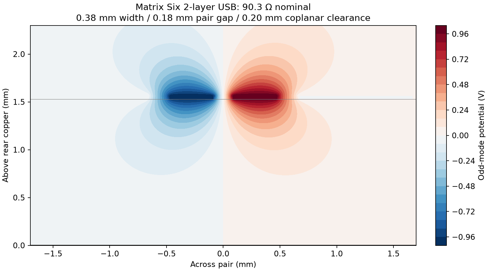

# Matrix Six v0.8 — 2層への再設計

2026-09-08。v0.7の4層基板を、F.Cu / B.Cuだけの2層へ再設計した試作版です。内層配線を削除するだけの変換ではなく、信号・電源・USB・GNDを配線し直しました。オートルーターは使用していません。

## 維持した仕様

40.64 × 61 mm・四隅R2 mm、H1/H2の全40位置、Matrix5の38割当端子＋2 NC、全11シールドの使用ピンを維持しています。USBと左右のRESET/BOOT、下部POWER/PIN 48 LED、裏面microSDの15.8 × 22.5 mm抜き差し空間、裏面LiPo端子と100 mA充電・自動切替を維持しました。表面のMatrix Sixは文字高2.0 mmへ拡大し、直下にDesigned by GPT-6 Astra（文字高0.8 mm）を配置しています。

部品は48個、BOMは26グループで同じ型番です。配線経路のためR5/C4/C5/R8/R9等を移動し、R6を裏面、C11を表面へ移しました。C11はmicroSD用のバルク容量で、裏面スロット近傍のC12 100 nFは保持しています。現在の座標・面・回転は[v0.8 CPL](../manufacturing/v0.8/assembly/Matrix6-v0.8-CPL.csv)と[実装基準図](../manufacturing/v0.8/review/Matrix6-assembly-reference.png)を正としてください。

## 層構成と穴

| 項目 | v0.8 |
|---|---|
| 銅層 | F.Cu / B.Cuのみ |
| 製造時の指定 | FR4、公称1.6 mm、両面1 oz |
| CAD断面 | 表裏銅箔各0.035 mm、コア1.530 mm、εr=4.5 |
| レジストのモデル | 各0.0127 mm、εr=3.8。CAD全厚はレジスト込み1.6254 mm |
| 通常ビア | 完成穴径0.30 mm、銅箔径0.60 mm |
| U1放熱穴12個 | 完成穴径0.30 mm、銅箔径0.80 mm、環状幅0.25 mm |
| 最小PTH環状幅 | USBの長穴部0.20 mm、検査下限0.18 mm |

U1の旧0.2 mm穴を0.3 mmへ広げ、2層の微細穴料金区分を避ける形状にしました。放熱・パッド内ビアのエポキシ充填と銅キャップは製造要求に残ります。コネクタ挿入穴、USB長穴、NPTHは開口します。充填方式・料金・仕上がりの最終確認はCAMが必要です。

## USBとGND

USBはすべて表面、ビア0。USB本体下の表面配線・ビア・ベタは0です。禁止領域に意図的な違反を置いた一時コピーでも検出を確認しました。

均一断面は **線幅0.38 mm、線間0.18 mm、両脇GNDとの間隔0.20 mm**。直線区間Y=128.5〜141.5 mmで、各側0.5 mm幅のGND帯を各1,563点検査し、欠損0を確認しました。裏面ベタは信号配線で4領域に分かれ、表面とスティッチを通じて導通しています。裏面全体を連続した参照プレーンとは見なしません。

| USB経路 | D− | D＋ | 長さ差 |
|---|---:|---:|---:|
| 直列抵抗〜USB-C A側 | 48.020 mm | 48.020 mm | <0.01 mm |
| 直列抵抗〜USB-C B側 | 46.303 mm | 46.303 mm | <0.01 mm |
| モジュール〜直列抵抗 | 1.714 mm | 1.712 mm | 0.003 mm |

A側D＋にはR11のパッド中心間1.65 mmを幾何学的な長さとして含みます。部品内部の電気的遅延を測定した値ではありません。

[2D奇モード静電界計算](analysis/two-layer-usb.json)では、公称90.22 Ω、細かいメッシュで90.26 Ω。両脇GND幅を検査済みの0.5 mmに限定して90.26 Ω、遠方の裏面参照を除いた場合90.30 Ωでした。線幅±0.02 mm、線間±0.02 mm、GND間隔±0.02 mm、εr±0.2を組み合わせた感度ケースは83.72〜96.91 Ωです。**これらの振れ幅は仮定で、JLCPCBの保証公差ではありません。**

この計算は均一断面に限定され、コネクタ・部品・曲がり・長さ調整部や周波数依存損失を含みません。管理インピーダンス保証、TDR、USB規格適合の代わりにはなりません。JLCPCB標準2層では管理インピーダンスの保証を前提にせず、試作での確認を必要とする設計です。[EspressifのUSB配線要件](https://docs.espressif.com/projects/esp-hardware-design-guidelines/en/latest/esp32s3/pcb-layout-design.html)、[JLCPCBの材料・製造能力](https://jlcpcb.com/capabilities/pcb-capabilities/)

## 電源・帰路の計算

銅温度60℃、銅厚35 µm、ビアめっき20 µmの仮定です。配線の抵抗は実際の経路から算出しています。負荷条件と電源ICの制限は[README](../README.md)および[v0.6電源設計](matrix-six-v06.md)に従います。

| 経路 | 負荷 | 銅配線の電圧降下 |
|---|---:|---:|
| 3.3 Vコンバーター→ESP32 | 500 mA | 49.9 mV |
| 3.3 Vコンバーター→H1 | 500 mA | 27.9 mV |
| 3.3 Vコンバーター→microSD | 200 mA | 11.0 mV |
| LiPo→切替PFET | 800 mA | 13.2 mV |
| 切替PFET→コンバーター | 800 mA | 12.7 mV |

各行は経路の検討条件で、これらの電流を同時に加算してよい意味ではありません。3.3 VはMCU・SD・シールドを含む合計500 mAを設計条件とします。

表裏の充填済みGND、GNDパッド・配線、穴、65個の層間接続を含めた[DCメッシュ計算](validation/ground-plane-dc.json)では、モジュール帰路500 mAで2.35 mV、入力帰路800 mAで6.45 mVです。前者は0.125→0.0625 mmのメッシュ細分化で1%以内に収束しました。表面GND検査の45個という値は通常のGNDビア数で、DCモデルの65接続はGNDのPTHパッド等も含みます。接触抵抗・はんだ抵抗は含みません。

IPC-2221式による配線温度上昇のスクリーニング値は最大約6.1℃。周囲・銅温度の仮定、熱の拡散、部品自身の損失によって実温度は変わります。IPC-2152評価や熱解析・実測ではありません。

## 検証と製造の状態

- KiCad 10.0.6：全重大度のDRC 0、ERC 0、未配線0、回路図整合性違反0。
- Matrix5の40位置と11シールド、SD抜き差し、USB底面禁止領域、R2外形、最小穴・環状幅を検証。
- GND再充填後の[CADハッシュ](validation/cad-sha256.json)を保存。製造出力時に同一CADか再照合。
- USB両挿し向き・実機通信、SI/EMC、Wi-FiとSDの同時動作、低電池時の電源切替、突入電流・最大負荷・温度は試作で検証する項目。
- v0.7の既存注文は旧4層のまま。v0.8で支払い・製造承認は行っていない。最終的な削減額は2層の再見積もりで確定する。

再現用の座標指定変更は `scripts/redesign_two_layer.py` と `scripts/two_layer_routes.py`。4層版 `f12c10f` を入力として現在のCADを上書きするので、通常は `scripts/verify_project.py` だけを実行してください。
